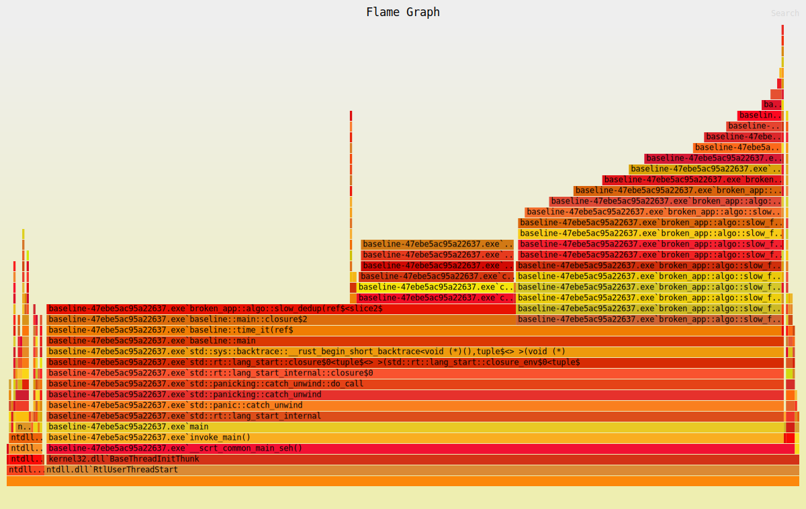

# До исправления

## Тесты

```bash
cargo test sums_even_numbers
```

```text
running 1 test

thread 'sums_even_numbers' (5200) panicked at src/lib.rs:11:29:
unsafe precondition(s) violated: slice::get_unchecked requires that the index is within the slice

This indicates a bug in the program. This Undefined Behavior check is optional, and cannot be relied on for safety. 
thread caused non-unwinding panic. aborting.
error: test failed, to rerun pass `--test integration`
```

```bash
cargo test averages_only_positive
```

```text
running 1 test
test averages_only_positive ... FAILED

failures:

---- averages_only_positive stdout ----

thread 'averages_only_positive' (5589) panicked at tests/integration.rs:36:5:
assertion failed: (broken_app::average_positive(&nums) - 10.0).abs() < f64::EPSILON
```

## cargo check

```text
warning[E0133]: dereference of raw pointer is unsafe and requires unsafe block
  --> src/lib.rs:60:15
   |
60 |     let val = *raw;
   |               ^^^^ dereference of raw pointer
   |
   = note: raw pointers may be null, dangling or unaligned; they can violate aliasing rules and cause data races: all of these are undefined behavior


warning[E0133]: call to unsafe function `std::boxed::Box::<T>::from_raw` is unsafe and requires unsafe block
  --> src/lib.rs:61:10
   |
61 |     drop(Box::from_raw(raw));
   |          ^^^^^^^^^^^^^^^^^^ call to unsafe function
   |
   = note: consult the function's documentation for information on how to avoid undefined behavior

warning[E0133]: dereference of raw pointer is unsafe and requires unsafe block
  --> src/lib.rs:62:11
   |
62 |     val + *raw
   |           ^^^^ dereference of raw pointer
   |
   = note: raw pointers may be null, dangling or unaligned; they can violate aliasing rules and cause data races: all of these are undefined behavior
```

## Miri

```bash
cargo +nightly miri run
```

```text
error: Undefined Behavior: `assume` called with `false`
  --> src/lib.rs:11:22
   |
11 |             let v = *values.get_unchecked(idx);
   |                      ^^^^^^^^^^^^^^^^^^^^^^^^^ Undefined Behavior occurred here
   |
   = help: this indicates a bug in the program: it performed an invalid operation, and caused Undefined Behavior
```

## Valgrind

Предварительно закомментировав sum_even чтобы не было паники из-за UB

```bash
valgrind --leak-check=full --show-leak-kinds=all   ./target/debug/demo
```

```text
==5795== Memcheck, a memory error detector
==5795== Copyright (C) 2002-2022, and GNU GPL'd, by Julian Seward et al.
==5795== Using Valgrind-3.22.0 and LibVEX; rerun with -h for copyright info
==5795== Command: ./target/debug/demo
==5795==
sum_even: 0
non-zero bytes: 3
normalize: helloworld
fib(20): 6765
dedup: [1, 2, 3, 4]
==5795== 
==5795== HEAP SUMMARY:
==5795==     in use at exit: 548 bytes in 2 blocks
==5795==   total heap usage: 15 allocs, 13 frees, 3,714 bytes allocated
==5795==
==5795== 4 bytes in 1 blocks are definitely lost in loss record 1 of 2
==5795==    at 0x4846828: malloc (in /usr/libexec/valgrind/vgpreload_memcheck-amd64-linux.so)
==5795==    by 0x15BC59: <alloc::raw_vec::RawVecInner>::try_allocate_in (in /mnt/c/Users/ivany/Desktop/Rust_YP/broken-app/target/debug/demo)
==5795==    by 0x128767: alloc::raw_vec::RawVecInner<A>::with_capacity_in (library/alloc/src/raw_vec/mod.rs:433)     
==5795==    by 0x12A3E5: with_capacity_in<u8, alloc::alloc::Global> (library/alloc/src/raw_vec/mod.rs:177)
==5795==    by 0x12A3E5: with_capacity_in<u8, alloc::alloc::Global> (library/alloc/src/vec/mod.rs:965)
==5795==    by 0x12A3E5: <T as alloc::slice::<impl [T]>::to_vec_in::ConvertVec>::to_vec (library/alloc/src/slice.rs:448)
==5795==    by 0x12A38B: to_vec_in<u8, alloc::alloc::Global> (library/alloc/src/slice.rs:400)
==5795==    by 0x12A38B: alloc::slice::<impl [T]>::to_vec (library/alloc/src/slice.rs:376)
==5795==    by 0x1244FC: broken_app::leak_buffer (lib.rs:23)
==5795==    by 0x123EC9: demo::main (demo.rs:8)
==5795==    by 0x12446A: core::ops::function::FnOnce::call_once (library/core/src/ops/function.rs:250)
==5795==    by 0x123BCD: std::sys::backtrace::__rust_begin_short_backtrace (library/std/src/sys/backtrace.rs:166)    
==5795==    by 0x123C30: std::rt::lang_start::{{closure}} (library/std/src/rt.rs:206)
==5795==    by 0x152173: call_once<(), (dyn core::ops::function::Fn<(), Output=i32> + core::marker::Sync + core::panic::unwind_safe::RefUnwindSafe)> (function.rs:287)
==5795==    by 0x152173: do_call<&(dyn core::ops::function::Fn<(), Output=i32> + core::marker::Sync + core::panic::unwind_safe::RefUnwindSafe), i32> (panicking.rs:581)
==5795==    by 0x152173: catch_unwind<i32, &(dyn core::ops::function::Fn<(), Output=i32> + core::marker::Sync + core::panic::unwind_safe::RefUnwindSafe)> (panicking.rs:544)
==5795==    by 0x152173: catch_unwind<&(dyn core::ops::function::Fn<(), Output=i32> + core::marker::Sync + core::panic::unwind_safe::RefUnwindSafe), i32> (panic.rs:359)
==5795==    by 0x152173: {closure#0} (rt.rs:175)
==5795==    by 0x152173: do_call<std::rt::lang_start_internal::{closure_env#0}, isize> (panicking.rs:581)
==5795==    by 0x152173: catch_unwind<isize, std::rt::lang_start_internal::{closure_env#0}> (panicking.rs:544)       
==5795==    by 0x152173: catch_unwind<std::rt::lang_start_internal::{closure_env#0}, isize> (panic.rs:359)
==5795==    by 0x152173: std::rt::lang_start_internal (rt.rs:171)
==5795==    by 0x123C16: std::rt::lang_start (library/std/src/rt.rs:205)
==5795==
==5795== 544 bytes in 1 blocks are still reachable in loss record 2 of 2
==5795==    at 0x4846828: malloc (in /usr/libexec/valgrind/vgpreload_memcheck-amd64-linux.so)
==5795==    by 0x154A49: alloc (alloc.rs:95)
==5795==    by 0x154A49: alloc_impl_runtime (alloc.rs:190)
==5795==    by 0x154A49: alloc_impl (alloc.rs:312)
==5795==    by 0x154A49: allocate (alloc.rs:429)
==5795==    by 0x154A49: try_new_uninit_in<alloc::collections::btree::node::LeafNode<usize, std::sys::pal::unix::stack_overflow::thread_info::ThreadInfo>, alloc::alloc::Global> (boxed.rs:614)
==5795==    by 0x154A49: new_uninit_in<alloc::collections::btree::node::LeafNode<usize, std::sys::pal::unix::stack_overflow::thread_info::ThreadInfo>, alloc::alloc::Global> (boxed.rs:581)
==5795==    by 0x154A49: new<usize, std::sys::pal::unix::stack_overflow::thread_info::ThreadInfo, alloc::alloc::Global> (node.rs:87)
==5795==    by 0x154A49: new_leaf<usize, std::sys::pal::unix::stack_overflow::thread_info::ThreadInfo, alloc::alloc::Global> (node.rs:225)
==5795==    by 0x154A49: insert_entry<usize, std::sys::pal::unix::stack_overflow::thread_info::ThreadInfo, alloc::alloc::Global> (entry.rs:403)
==5795==    by 0x154A49: insert<usize, std::sys::pal::unix::stack_overflow::thread_info::ThreadInfo, alloc::alloc::Global> (entry.rs:377)
==5795==    by 0x154A49: insert<usize, std::sys::pal::unix::stack_overflow::thread_info::ThreadInfo, alloc::alloc::Global> (map.rs:1053)
==5795==    by 0x154A49: std::sys::pal::unix::stack_overflow::thread_info::set_current_info (thread_info.rs:122)     
==5795==    by 0x1520AC: init (stack_overflow.rs:179)
==5795==    by 0x1520AC: init (mod.rs:41)
==5795==    by 0x1520AC: init (rt.rs:118)
==5795==    by 0x1520AC: {closure#0} (rt.rs:173)
==5795==    by 0x1520AC: do_call<std::rt::lang_start_internal::{closure_env#0}, isize> (panicking.rs:581)
==5795==    by 0x1520AC: catch_unwind<isize, std::rt::lang_start_internal::{closure_env#0}> (panicking.rs:544)       
==5795==    by 0x1520AC: catch_unwind<std::rt::lang_start_internal::{closure_env#0}, isize> (panic.rs:359)
==5795==    by 0x1520AC: std::rt::lang_start_internal (rt.rs:171)
==5795==    by 0x123C16: std::rt::lang_start (library/std/src/rt.rs:205)
==5795==    by 0x12413D: main (in /mnt/c/Users/ivany/Desktop/Rust_YP/broken-app/target/debug/demo)
==5795==
==5795== LEAK SUMMARY:
==5795==    definitely lost: 4 bytes in 1 blocks
==5795==    indirectly lost: 0 bytes in 0 blocks
==5795==      possibly lost: 0 bytes in 0 blocks
==5795==    still reachable: 544 bytes in 1 blocks
==5795==         suppressed: 0 bytes in 0 blocks
==5795==
==5795== For lists of detected and suppressed errors, rerun with: -s
==5795== ERROR SUMMARY: 1 errors from 1 contexts (suppressed: 0 from 0)
```


## Bench

Предварительно закомментировав sum_even, bench виснет из-за UB
```bash
cargo bench --bench baseline > artifacts/baseline_before.txt
```

```text
slow_fib: 5.144946ms
slow_dedup: 8.259715ms
slow_fib: 4.663762ms
slow_dedup: 8.362795ms
slow_fib: 4.710503ms
slow_dedup: 8.462111ms
```

## Flamegraph
Предварительно закомментировав sum_even, flamegraph виснет из-за UB
flamegraph-windows.ps1 нужен для нормального отображения названий функций
```bash
.\scripts\flamegraph-windows.ps1
```

Широкий блок sort_unstable ~20% для slow_dedup из-за сортировки после каждой операции 
В slow_fib много вызовов slow_fib на разных уровнях стека



## Criterion

```bash
cargo bench --bench criterion
```

```text
sum_even_broken         time:   [211.91 ps 212.29 ps 212.69 ps]
Found 11 outliers among 100 measurements (11.00%)
  5 (5.00%) high mild
  6 (6.00%) high severe

slow_fib_broken         time:   [4.2790 ms 4.2882 ms 4.2991 ms]
Found 12 outliers among 100 measurements (12.00%)
  4 (4.00%) high mild
  8 (8.00%) high severe

slow_dedup_broken       time:   [10.755 ms 10.770 ms 10.787 ms]
Found 6 outliers among 100 measurements (6.00%)
  4 (4.00%) high mild
  2 (2.00%) high severe
```


